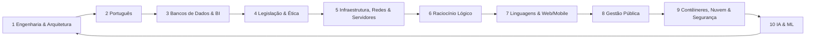

# Ciclo de Estudos

## Regra
Um assunto/bloco relevante por matéria → questões → correção → revisão → próxima matéria.

## Importante
Dentro de cada disciplina existe uma sequência pedagógica, mas o projeto **não termina uma matéria inteira antes de trocar**. O ciclo intercala as disciplinas para manter contato frequente com todo o edital.
